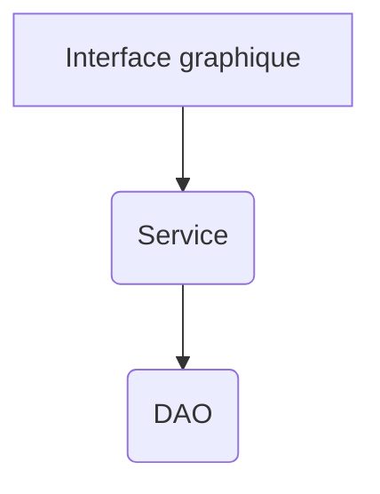

# Structurer son code en Android

## Hiérarchie des fichiers

Il existe 2 grandes approches pour organiser les fichiers / classes:
1. par fonctionnalité
2. par type d'objet

Pour prendre un exemple, pour une application avec les classes suivantes:
- ConnexionActivity
- InscriptionActivity
- ListeDesTachesActivity : donne la liste des tâches reliées à un compte
- TacheActivity : donne les détails d'une tâche et la liste des modifications
- TachesAdapter : adapteur de l'activité ListeDesTachesActivity
- ModifAdapter : adapteur de l'activité TacheActivity
- Tache : classe qui représente une tâche
- Modif : classe qui représente une modification

L'approche est souvent décidée avec l'ensemble de l'équipe de développement et fera partie
des standards de développement qu'on doit respecter.

Pour un projet personnel, on peut choisir l'approche qui nous semble la plus naturelle.

### Approche fonctionnalité

- package com.monapp
  - com.monapp.connexion
    - ConnexionActivity
  - com.monapp.inscription
    - InscriptionActivity
  - com.monapp.taches
    - ListeDesTachesActivity
    - TachesAdapter
    - Tache
  - com.monapp.detail
    - TacheActivity
    - ModifAdapter
    - Modif

### Appproche par type d'objet

- package com.monapp
  - com.monapp.activity
    - ConnexionActivity
    - InscriptionActivity
    - ListeDesTachesActivity
    - TacheActivity
  - com.monapp.adapter
    - TachesAdapter
    - ModifAdapter
  - com.monapp.model
    - Tache
    - Modif

### En pratique

On peut simplement utiliser le refactoring d'Android Studio pour déplacer les fichiers.

## Approche service

Voici le schéma mermaid d'une approche service où on sépare l'interface graphique, d'un service et d'un objet d'acces aux donnees
    

Les avantages:
- On pourrait réutiliser le même service (le même code) pour une application web ou une application console
- On peut tester une méthode d'un service avec des tests unitaires sans avoir besoin de l'interface graphique
- On peut éventuellement changer de moteur de BD sans changer le service ni l'interface graphique

Quelques tests pour vérifier si on s'y est bien pris:
- Il ne devrait y avoir aucun code de BD dans le service (aucun import spécifique à la BD)
- Il ne devrait y avoir aucun code d'interface graphique dans le service (aucun import spécifique à l'interface graphique)

### Comment gérer les erreurs dans le service

Comme nous n'avons pas le droit d'avoir du code UI dans le service, il faut trouver un moyen
de prévenir le code UI d'une erreur.

On va simplement lancer une exception.

# Modèle (entités) et service (actions)

## Contenu

Nous allons voir comment appliquer la décomposition en entités (modèle) et actions (service) sur l'exemple suivant:

On veut une application qui permet d'aller chercher l'avis de personnes sur des films, des disques, un peu de tout. On veut pouvoir ajouter un item dans l'appli pour pouvoir entrer les avis des gens. On peut voir la liste de tous les items et pour chaque item, on veut pouvoir ajouter une évaluation (une note entre 0 et 5) ainsi que le nom de la personne. On veut aussi calculer des statistiques comme la moyenne des notes pour un item, l'écart-type ou encore le nombre de personnes ayant donné la note de 0, 1, 2, 3, 4 ou 5.

On s'arrêtera aux signatures des méthodes d'action et aux classes de modèle.

<Row>

<Column>

:::warning Avant la séance (2h)

Regarder la video qui décrit comment concevoir une application en fonction :

- des entités à représenter
- des actions à fournir à l'utilisateur

:::

</Column>

<Column>

:::tip Vidéos

<Video url="https://youtu.be/MmpgnWLEa5s" />

:::

</Column>

<Column>

:::info À faire pendant la séance

Compléter l'exercice de la semaine les exercices de la semaine. Continuer le travail évalué en cours.

:::

</Column>

</Row>

:::note Exercices

### Exercice Notes

Vous devez appliquer la même méthode de décomposition en entités et actions sur l'exemple suivant:

On cherche à réaliser une application permettant de gérer des étudiants et leurs notes. L'application permet de créer des épreuves avec une pondération. L'ensemble des épreuves donne une somme de poids de 100. On peut créer des étudiants dans le système. Finalement, on peut saisir les notes pour un étudiant et pour une épreuve.

Après la saisie de chaque nouvelle note d'étudiant, le système donne le détail de la situation de l'étudiant.

Prenez cet exemple pour votre application (TP). Vous devez définir le modèle de données ainsi que le service sous la forme des méthodes nécessaires.

:::

