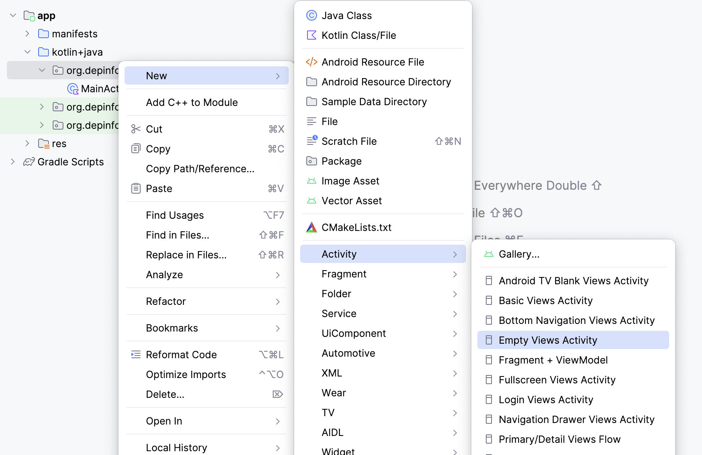
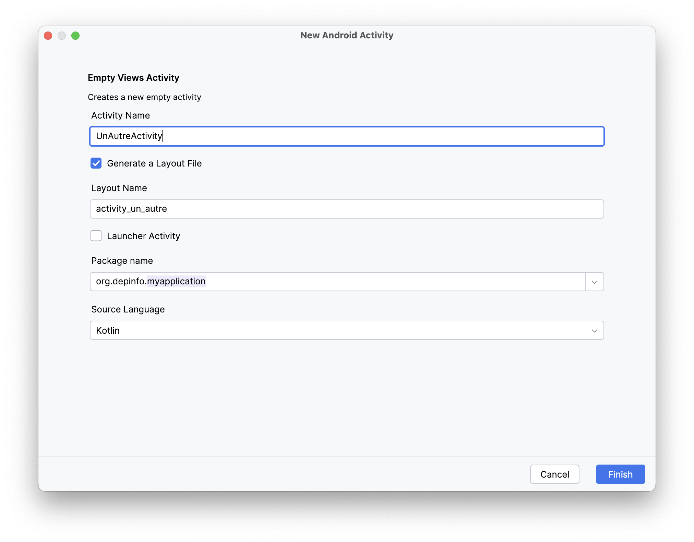

# Activités et Navigation

En Android, une activité représente généralement un "écran" à afficher à un utilisateur.

Pour passer d'une activité à une autre, nous allons utiliser un [Intent](https://developer.android.com/reference/android/content/Intent),
qui peut se traduire comme une "intention" de lancer une nouvelle activité.

## Créer une nouvelle activité

<Row>

<Column>

Pour créer une nouvelle activité, vous pouvez effectuer un clic droit sur le package de votre application, et utiliser le menu `New` > `Activity` > `Empty Views Activity`.

</Column>

<Column>



</Column>

</Row>


<Row>

<Column>

Sur l'écran de création, vous avez certains choix à faire :

- **Activity Name** : Le nom de la classe de l'activité. La convention pour les nouvelles activités est de suffixer le nom de l'activité avec `Activity`.
- **Generate Layout File** : Cochez cette case pour générer un fichier de layout associé à l'activité. Généralement, on laisse cette case cochée.
- **Layout Name** : Le nom du fichier de layout associé à l'activité. La convention est de préfixer le nom du layout avec `activity_`.
- **Launcher Activty** : Cochez cette case si vous voulez que l'activité soit la première à être lancée lors du démarrage de l'application. Généralement on laisse cette case décochée.
- **Package name** : Le package où l'activité va être ajoutée. Généralement, on laisse le package par défaut, ou on spécifie un package où toutes les activitées vont être.
- **Source Language** : Le langage de programmation à utiliser pour l'activité. Pour le cours de programmation mobile, on utilise Kotlin.

</Column>

<Column>



</Column>

</Row>

:::info Le saviez vous?

Il est possible d'avoir des fichiers java et kotlin dans un même projet. Vous pouvez demander à votre enseignant de vous expliquer pourquoi!

:::

## Démarrer une activité

Le cas typique pour démarrer une activité est en réagissant à l'appui sur un bouton.

- Nous sommes dans une activité quelconque.
- On désire démarrer l'activité nommée `AutreActivity`.

```kotlin
// On réagit au clic sur un bouton
binding.btnMonBouton.setOnClickListener {
    // On crée l'intent, qui a besoin :
    // 1. Du contexte actuel
    // 2. De la classe d'activité à démarrer. 
    val monIntent = Intent(this, AutreActivity::class.java)

    // On démarre l'activité en lui passant l'intent qu'on vient de créer.
    startActivity(monIntent)
}
```

## Démarrer une activité en lui passant de l'information

- Un champ texte permet d'entrer son animal préféré.
- À l'appui d'un bouton, on souhaite démarrer l'activité `AutreActivity`.
- Le nom de l'animal préféré qui provient de `MainActivity` doit apparaître sur un `TextView` dans `AutreActivity`.

### `MainActivity`

```kotlin
binding.btnMonBouton.setOnClickListener {
    val monIntent = Intent(this, AutreActivity::class.java)
    monIntent.putExtra("ANIMAL", binding.monChampTexte.text.toString())
    startActivity(monIntent)
}
```

### `AutreActivity`

```kotlin
// On vérifie toujours si un extra a été fourni par l'activité précédente. 
if(intent.hasExtra("ANIMAL")) {
    // Si l'extra "ANIMAL" a été fourni, on l'obtient, et on le met dans le TextView tvMonAnimal.
    binding.tvMonAnimal.text = intent.getStringExtra("ANIMAL")
}
```

## Démarrer une activité à partir d'un RecyclerView

Vous pouvez vous référer à cette [recette](recycler-view-03-activite.mdx) pour apprendre à démarrer une activité à partir d'un élément d'un `RecyclerView`.

## Références

- [Documentation Android](https://developer.android.com/reference/android/content/Intent)
