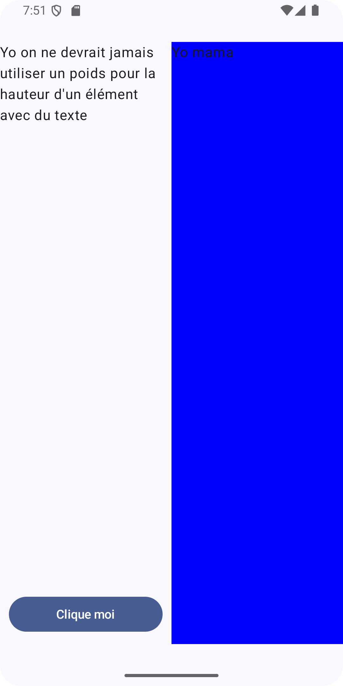
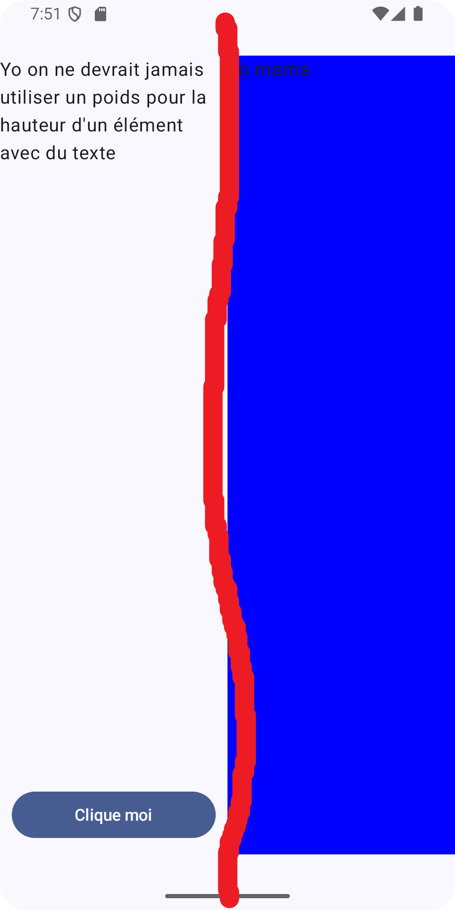
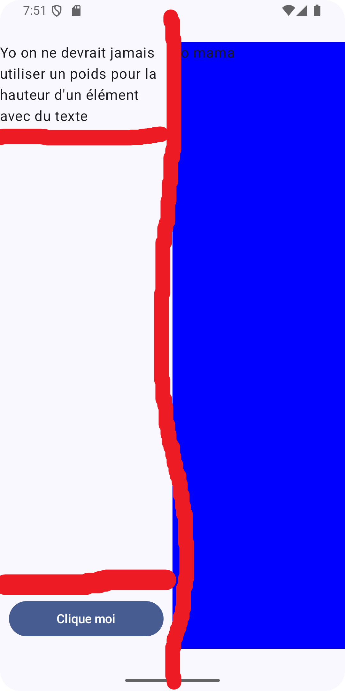

# Mise en page avec Jetpack Compose

Le code de cette recette est disponible [ici](https://github.com/departement-info-cem/3N5-Prog3/tree/main/code/ComposeMiseEnPage).

<Tabs queryString="recette-mise-en-page-compose">
  <TabItem value="principe" label="Principe">

    Quand on vous demande de faire une mise en page, on va suivre les étapes suivantes :
    - on va utiliser les fonctions `Row` et `Column` pour décomposer l'interface en lignes et colonnes
    - on commence par l'écran au complet puis on va décomposer
      - essaie de tracer des lignes verticales qui séparent au moins deux sous-éléments, si c'est possible on commence par une `Row`
      - essaie de tracer des lignes horizontales qui séparent au moins deux sous-éléments, si c'est possible on commence par une `Column`
      - c'est possible que les 2 soient possibles et que tu aies le choix
      - on crée une `Row` (ou une `Column`)
        - si le sous-élément est un simple Widget (Text, Image, Button, etc.), on l'ajoute directement dans la `Row` / `Column`
        - sinon on réapplique la même procédure pour le sous-élément
        - dans tous les cas on utilise le modifier pour dimensionner l'élément (width pour un Row, height pour une Column),
            - taille explicite en dp
            - weight pour prendre une portion de l'espace disponible
            - on utilisera jamais fillMaxWidth ou fillMaxHeight, puisque le but est de partager l'espace entre les éléments

  </TabItem>

  <TabItem value="simple" label="Mise en page simple">
    <Row>
        <Column size="3">
            
        </Column>
        <Column size="9">
            On va voir comment appliquer cette méthode de mise en page à un exemple simple.
            Voici l'image de l'interface à reproduire.
        </Column>
    </Row>
    <Row>
            <Column size="3">
                
            </Column>
            <Column size="9">
                On voit qu'on peut tracer un trait vertical pour séparer l'interface en deux parties.

                Par contre on voit que si on trace horizatalement, on va toujours couper l'élément bleu.

                On voit que la partie gauche est encore composée de plus que un élément, un texte et un bouton.

                Par contre la partie droite est composée d'un seul élément, un texte.

                Finalement on voit que les 2 parties sont de même taille, on peut donc leur donner le même poids (weight).

                On aurait donc la structure suivante :
                - Row
                  - Sous élément (poids 1)
                  - Text (poids 1)

                On va appliquer la même procédure pour le sous élément de gauche.
            </Column>
        </Row>
    <Row>
        <Column size="3">
            
        </Column>
        <Column size="9">
            On voit que le sous-élément de gauche est composé de plusieurs éléments, un texte, un espace et un bouton.

            On peut donc tracer une ligne horizontale pour séparer les trois éléments.

            On va donc avoir la structure suivante :
            - Row
              - **Column** (poids 1)
                - Text (prend sa taille naturelle)
                - Spacer (élément avec un weight qui va consommer l'espace restant)
                - Button (prend sa taille naturelle) avec le texte "Clique moi"
              - Text (poids 1) "yo mama"

            Tout est décomposé, on a fini.
        </Column>
    </Row>

    Le code est finalement:
    <GHCode
                repo="3N5-Prog3"
                filePath="code/ComposeMiseEnPage/app/src/main/java/ca/cem/composemiseenpage/MainActivity.kt"
                  startLine="60"
                  endLine="98"
               />

    L'exemple mep-simple donne un exemple. L'exemple mep-complexe donne un exemple plus complexe.

    </TabItem>

  <TabItem value="tester" label="Basculer entre les deux">
    En cherchant les TODOs dans le code, trouve l'endroit où on bascule entre les deux mises en page.
    Relance l'application et vérifie que tu peux basculer entre les deux mises en page.
  </TabItem>
  <TabItem value="deboguer" label="Déboguer une mise en page">
      On va utiliser le `Layout Inspector` pour déboguer une mise en page.

      1. Bascule le code vers `mep-brisée`
      2. Lance l'application
      3. Ouvre le `Layout Inspector` dans Android Studio
      4. Trouve l'élément qui est mal positionné / dimensionné et corrige le problème dans le code
      5. Si ça bloque, demande à ton enseignant de l'aide

  </TabItem>

    <TabItem value="explorer" label="Explorer le code">

        On t'encourage à explorer le code de l'application pour voir comment les mises en page sont implantées.

        N'hésite pas à lancer le Layout Inspector pour voir comment les éléments sont positionnés et dimensionnés.

        Le code de cette recette est disponible [ici](https://github.com/departement-info-cem/3N5-Prog3/tree/main/code/ComposeMiseEnPage).

      </TabItem>
</Tabs>

