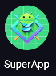
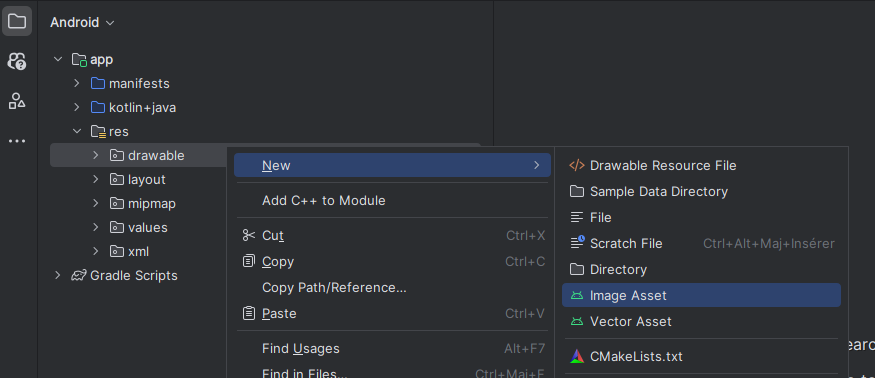
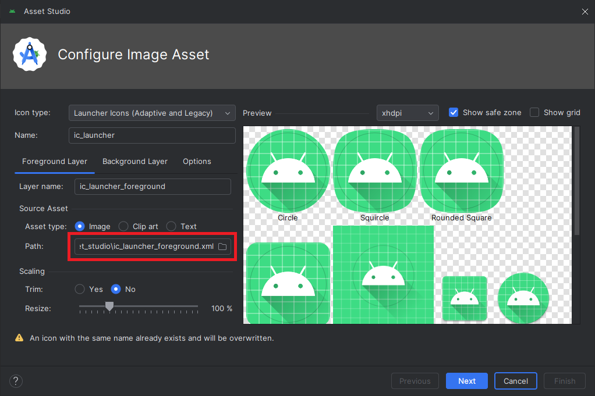
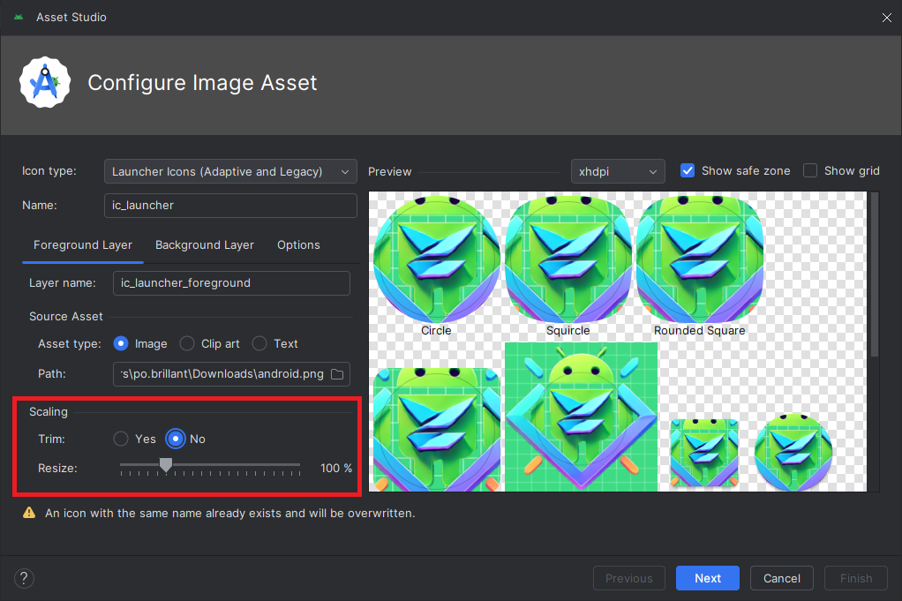

# Logo

<Row>

<Column>

Le logo de votre application fait partie de son identitée visuelle. 

C'est ce logo qui se retrouve sur l'écran d'accueil de l'utilisateur qui télécharge votre application sur le PlayStore.

C'est important de se distinguer en utilisant un logo qui représente bien votre application.

</Column>

<Column size="3" >

</Column>

</Row>

## Changer le logo de votre application.

Allez chercher le logo sur votre ordinateur :

Il se peut que votre logo ne soit pas bien centré, trop gros ou trop petit.
Vous pouvez jouer avec les options de **Scaling** pour l'ajuster.

Une fois que vous êtes satisfaits de votre logo, appuyez sur **Next**.

L'écran suivant vous fait un récapitulatif de votre nouveau logo.
Si vous êtes satisfat, appuyez sur **Next**.

## Aller plus loin

Android doit s'assurer que votre logo sera visible sur plusieurs types de périphériques. 
C'est pourquoi plusieurs densité de pixels sont disponibles pour visualiser votre logo.

C'est pourquoi à l'étape de révision, on voit que plusieurs fichiers pour les différentes tailles sont générés.

:::info 

DPI signifie **D**ots **P**er **I**nch, ou en français PPP pour **P**ixels **P**ar **P**ouce

:::