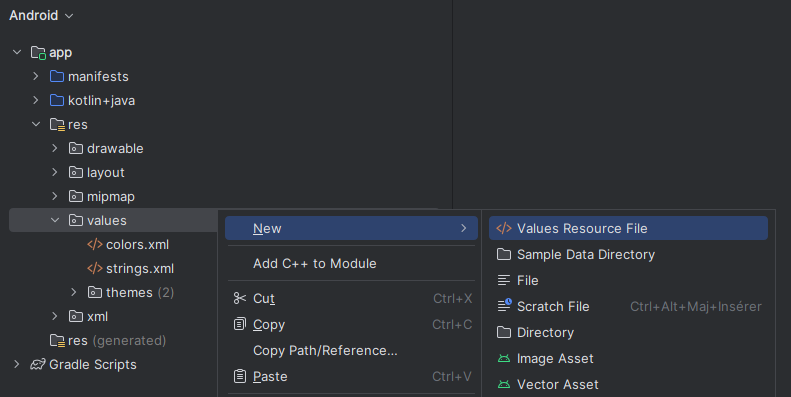
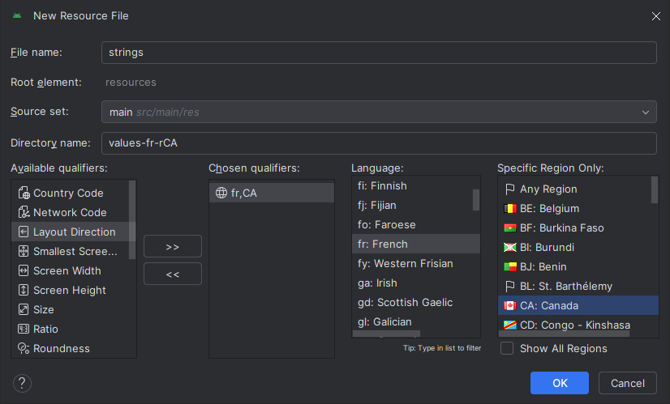
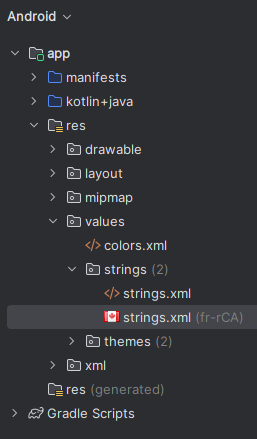

# Multilingue et String

Rendre une application multilingue vous permet de rejoindre un plus grand bassin d'utilisateurs.

## Ajouter un langage supporté

:::danger Attention!

Vous devez consulter la recette sur le **[Multilingue et String](./multilingue.mdx)** avant de commencer à consulter cette recette. Les notions vues dans les Ressources de string sont réutilisées ici.

:::


1. Clic droit sur `res > values`, naviguer dans `New` et sélectionner **Values Resource File**.



2. Nommez le fichier exactement `strings`
3. Sélectionner Locale, et appuer sur les flèches `>>`
4. Sélectionnez la langue qui vous intéresse, ainsi que sa variante régionale, si nécessaire.
5. Sélectionner **OK**



:::tip

La région spécifique est optionelle. Si on sélectionne **Any Region**. la traduction va s'appliquer pour toutes les variantes de la langue.

:::


6. Le fichier devrait être créé



7. Vous pouvez ajouter des chaines de caractères comme montré dans la recette sur les **[Ressource String](./multilingue.mdx)**. Dans l'exemple donné, si le périphérique est en français québécois, le fichier `strings.xml (fr-rCA)` sera utilisé.

8. Cherchez en ligne comment changer la langue de votre appareil pour tester vos changements.


:::caution

Le fichier `strings.xml` (sans rien après) est le fichier qui sera utilisé si Android ne trouve pas une string dans un fichier de traduction.
Assurez vous que chaque référence à une string utilisée dans votre code se retrouve dans le fichier `strings.xml`

:::


# Ressources String

Il est possible d'ajouter des ressources de type `String` dans un fichier XML.
Cela permet de centraliser les chaînes de caractères utilisées dans l'application, et ainsi d'éviter de les répéter dans le code.

Il est aussi parfois requis d'utiliser ces ressources string pour certaines fonctionnalités, comme le **[multilingue](./multilingue.mdx)**, et le **[tiroire de navigation](./tiroir.mdx)**.

## Ajout d'une entrée dans le fichier `strings.xml`

Pour ajouter une nouvelle entrée dans le fichier `strings.xml`, il suffit d'ajouter une nouvelle balise `<string>` dans la section `<resources>`.

```xml
<resources>
    <string name="app_name">Mon application</string>
    <string name="nom_de_la_ressource">Bonjour le monde!</string>
</resources>
```

## Utilisation dans le code Kotlin

Utiliser la méthode `getString()` de la classe `Resources`.

```kotlin
val appName = resources.getString(R.string.nom_de_la_ressource)
```

## Utilisation dans le code XML

Utiliser la syntaxe `@string/nom_de_la_ressource`.

```xml
<TextView
    android:layout_width="wrap_content"
    android:layout_height="wrap_content"
    android:text="@string/hello_world" />
```

## Extraire une string dans un fichier XML ou Kotlin dans Android Studio

1. `Alt + Enter` sur la string à extraire
2. Sélectionner `Extract string resource`


