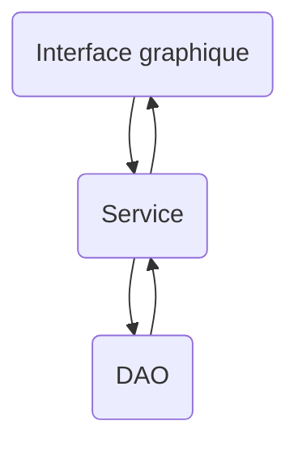

# Création d'un service / modèle de données

Comment appliquer la décomposition en entités (modèle) et actions (service)?

<Row>

<Column>

## Recette

1. On part d'un texte qui décrit l'application
2. On va encadrer les verbes d'action et entourer les noms
3. Regarder si plusieurs noms correspondent en fait au même élément
4. Chaque nom donne une entité, on va donc créer une classe
5. Chaque verbe d'action nous donne une méthode de service

</Column>

<Column>

## Exemple d'application de la recette sur un exemple

<Video url="https://youtu.be/MmpgnWLEa5s" />

La vidéo est en Java mais la méthode s'applique sans problème en kotlin.

</Column>

</Row>

<Row>

<Column>
## Approche service

Voici le schéma d'une approche service où on sépare l'interface graphique, le service et l'accès aux données :

</Column>
<Column>
## Avantages

- On pourrait réutiliser le même service (le même code) pour une application web ou une application console
- On peut tester une méthode d'un service avec des tests unitaires sans avoir besoin de l'interface graphique
- On peut éventuellement changer de moteur de BD sans changer le service ni l'interface graphique

Quelques tests pour vérifier si on s'y est bien pris:
- Il ne devrait y avoir aucun code de BD dans le service (aucun import spécifique à la BD)
- Il ne devrait y avoir aucun code d'interface graphique dans le service (aucun import spécifique à l'interface graphique)

</Column>
</Row>

### Comment gérer les erreurs dans le service

Comme nous n'avons pas le droit d'avoir du code UI dans le service, il faut trouver un moyen
de prévenir le code UI d'une erreur.

On va simplement lancer une exception.
