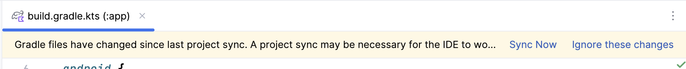

# View Binding

Dans les exemples du cours, nous intéragissons avec les éléments de l'interface graphique en utilisant le View Binding.

Nous allons voir comment activer le View Binding dans un projet Android.

:::tip View Binding vs Data Binding

Bien que nous utilisons le View Binding dans les exemples, il existe une autre méthode pour intéragir avec les éléments de l'interface graphique : le Data Binding.
Le Data Binding est plus complexe que le View Binding, mais il permet aussi de lier les données de l'application avec l'interface graphique.

Nous vous encourageons à lire la comparaison entre les deux méthodes [ici](https://developer.android.com/topic/libraries/view-binding?hl=fr#data-binding).

:::

## Activer le View Binding

Pour activer le View Binding dans un projet Android, il faut ajouter la ligne suivante dans le fichier `build.gradle` du module `app`:

```gradle
android {
    ...
    viewBinding {
        enable = true
    }
}
```

Une fois le View Binding activé, vous devez synchroniser le projet.



Cela va générer les classes de binding que nous allons utiliser pour intéragir avec les éléments de l'interface graphique.

## Utiliser le View Binding

Pour utiliser le View Binding, vous devez suivre les étapes suivantes :

1. Avant la méthode `onCreate`, récupérer le binding de l'activité :


```kotlin
private lateinit var binding: ActivityMainBinding
```

2. Dans la méthode `onCreate`, initialiser le binding et adapter le `setContentView` pour utiliser le binding :

```kotlin
binding = ActivityMainBinding.inflate(layoutInflater)
setContentView(binding.root)
```

3. Exemple d'utilisation du binding pour intéragir avec les éléments de l'interface graphique :


```kotlin
// Ici nous avons un élément graphique de type `TextView` avec l'identifiant `textView` qui est dans le fichier de layout `activity_main.xml`.
binding.textView.text = "Hello, World!"
```

:::caution Attention

Cette étape est à refaire dans chaque activité où vous voulez utiliser le View Binding.

Si votre fichier xml se nomme `activity_bonjour.xml`, le binding sera `ActivityBonjourBinding`.

:::


## Références

- [View Binding](https://developer.android.com/topic/libraries/view-binding?hl=fr)
